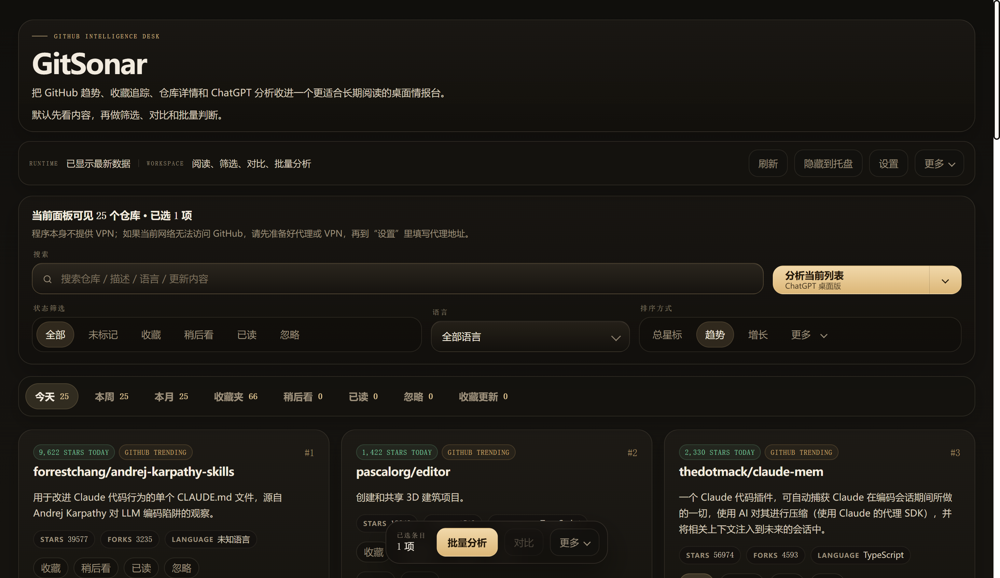

# GitSonar

[English](README.md) | [简体中文](README.zh-CN.md)

**GitSonar is a Windows desktop GitHub intelligence desk for ongoing repository discovery, organisation, tracking, and judgement.**



GitSonar is not just a Trending viewer. It combines trend discovery, keyword discovery, local workflow states, update tracking, repo detail reading, side-by-side comparison, saved judgement artifacts, and AI prompt handoff in one desktop workspace.

## Workflow

1. **Discover**
   Daily / weekly / monthly trend aggregation plus keyword discovery, saved discovery views, ranking profiles, recommendation reasons, local clustering, and a lightweight repo map.
2. **Organise**
   Local `Follow / Watch Later / Read / Ignore` states, tags, notes, ignore feedback, search, filters, sorting, batch actions, and state import / export.
3. **Track**
   Followed repo updates for push, star / fork, and release changes, with an Update Inbox for read, pin, dismiss, priority, since-last-viewed indicators, local summaries, and importance reasons.
4. **Judge**
   Repo detail drawer, README summary, side-by-side compare, Markdown summary export, AI prompt handoff, and manually saved structured Insight artifacts.

## What Is Implemented Today

- Trend aggregation for day / week / month.
- Keyword discovery with saved discovery views, saved searches, ranking modes, recommendation reasons, local result clustering, and a lightweight two-dimensional repo map.
- Local follow states, tags, notes, ignore feedback, batch actions, and user state import / export.
- Followed repo update tracking and an Update Inbox with read, pin, dismiss, priority, since-last-viewed indicators, local summaries, and importance reasons.
- Repo detail drawer, README summary, topics, license, homepage metadata, and side-by-side repo comparison.
- Markdown summary export for single repo, batch, and compare workflows.
- AI prompt handoff to ChatGPT web / desktop, Gemini web, or copy-only; multi-target handoff is supported.
- Manual `gitsonar.repo_insight.v1` structured Insight save / list / delete and local artifact metadata cache. This is not an embedded provider pipeline.
- JSON API boundary MVP for bootstrap, repos, updates, discovery views, jobs, events, SSE snapshots, and AI artifacts.
- SQLite migration dry-run skeleton with phase-one schema and backup / rollback path planning. JSON remains the fact storage.
- Local diagnostics panel for runtime status, proxy, token, GitHub reachability, and related troubleshooting signals.
- Optional local Ollama-style translation provider. It is explicit opt-in, loopback-only, and does not change the default translation path.
- Security hardening for DPAPI non-interactive handling, user-visible redaction, safe diagnostics, safe refresh and discovery errors, JSON body limits, and control-token protection for `/api/repo-details`.
- Single-instance wake-up, close-to-exit behavior, auto start, proxy support, and local token storage.

## Current AI Boundary

GitSonar does not currently call an embedded AI provider or return model-generated conclusions inside the app by default.

Implemented AI-adjacent behavior is:

- prompt handoff to external ChatGPT or Gemini targets;
- copy-only prompt workflows;
- manually saving structured Insight JSON back into the local app;
- local artifact metadata and listing.

Future provider integration must remain explicit opt-in and must show what data is sent before any cloud or local provider call.

## Who It Is For

- People who follow GitHub projects over time, not just once.
- Builders, researchers, product people, and heavy open-source users.
- Anyone who wants a desktop workspace instead of a one-off Trending page.

## Not Just A Trending Viewer

- A viewer helps you discover repos. GitSonar keeps the follow-up workflow on desktop.
- GitHub stars are only one signal. GitSonar adds local states, tags, notes, update tracking, detail reading, compare, and judgement tools.
- The app keeps the follow-up workflow on desktop with single-instance wake-up and explicit relaunch when needed.

## Terms

- **Local `Follow / Favorites / favorites`**
  The current UI and codebase still mix these labels. In practice they point to the same local follow list inside GitSonar.
- **GitHub `Star`**
  This is a GitHub platform action and metric. With a token configured, marking a repo as `Follow` will try to sync a GitHub star, and you can also import your existing GitHub stars into the local follow list.

## Quick Start

### Users

- GitSonar is a Windows desktop app.
- If this repository currently has published releases, download them from [GitHub Releases](https://github.com/1wsslda/github-trend-radar/releases):
  - `GitSonarSetup.exe`
  - `GitSonar.exe`
- `artifacts/` is a repo build-output directory, not the default download entry for normal users.
- There is currently **no auto-update and no code signing**. Windows SmartScreen may ask you to confirm before running.

### Developers

Requirements:

- Windows
- Python 3.12+

```powershell
python -m pip install -r requirements.txt
python src/gitsonar/__main__.py
powershell -ExecutionPolicy Bypass -File .\scripts\build_exe.ps1
powershell -ExecutionPolicy Bypass -File .\scripts\build_setup.ps1
```

One-click packaging:

```cmd
scripts\build_all_click.cmd
```

## Security & Data

- Packaged app data lives under `%LOCALAPPDATA%\GitSonar`.
- Repository development runs use `runtime-data/`.
- Legacy `%LOCALAPPDATA%\GitHubTrendRadar` data is merged on first run when needed.
- GitHub tokens and proxy URLs with credentials are stored locally with Windows DPAPI.
- Current network destinations may include GitHub and Google Translate. Optional local Ollama-style translation is loopback-only and explicit opt-in.
- AI analysis currently means prompt handoff to external ChatGPT or Gemini targets, plus manually saved local Insight artifacts. GitSonar does not silently call an embedded AI provider.

See [docs/SECURITY.md](docs/SECURITY.md) for the exact security boundary.

## Roadmap

Remaining planned work:

- SQLite runtime import / export and controlled storage cutover after the dry-run skeleton.
- Explicit opt-in AI provider pipeline for local Ollama and OpenAI-compatible endpoints.
- Encrypted backup / sync design after sync target, key management, and conflict policy decisions are clear.
- Code signing and auto-update only after certificate, private-key custody, timestamping, and release policy decisions are clear.

## Docs

- [docs/strategy/GITSONAR_STRATEGY.md](docs/strategy/GITSONAR_STRATEGY.md)
- [docs/roadmap/ROADMAP.md](docs/roadmap/ROADMAP.md)
- [docs/plans/PLAN_TEMPLATE.md](docs/plans/PLAN_TEMPLATE.md)
- [docs/ARCHITECTURE.md](docs/ARCHITECTURE.md)
- [docs/SECURITY.md](docs/SECURITY.md)
- [CHANGELOG.md](CHANGELOG.md)
- [CONTRIBUTING.md](CONTRIBUTING.md)

## License

This project is released under the [MIT License](LICENSE).
