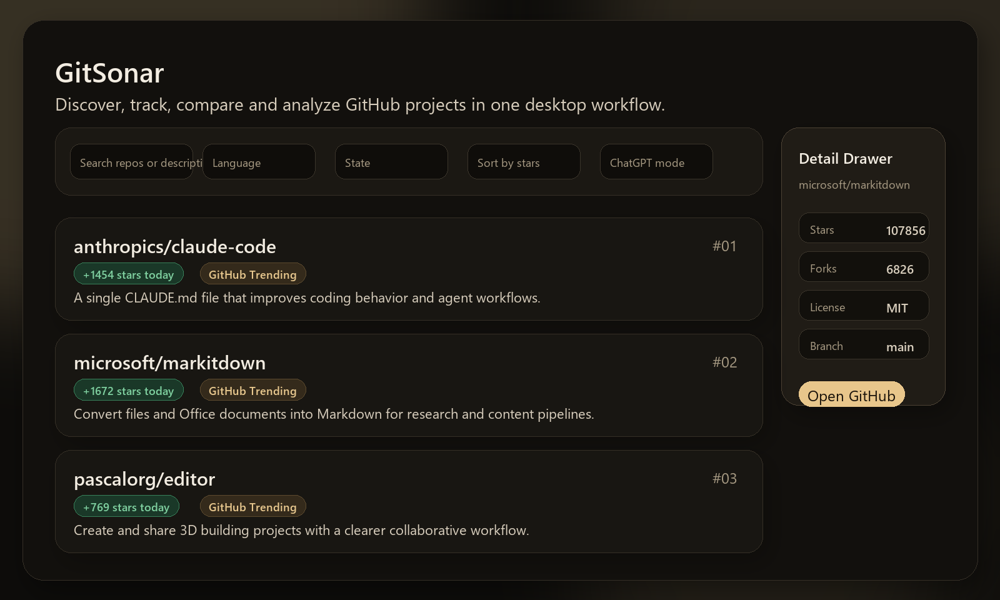
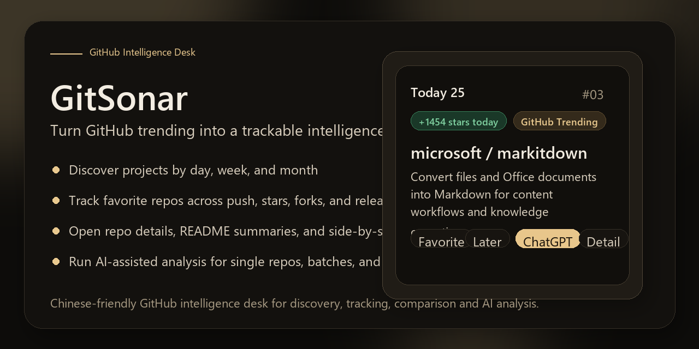

# GitSonar

> GitHub 情报台  
> 把 GitHub 热榜变成可追踪的项目情报流

GitSonar 不是把 GitHub Trending 简单搬到桌面，而是一套面向中文用户的 GitHub 项目情报工作台。它把热门项目发现、状态管理、收藏更新追踪、仓库对比和 AI 中文分析整合到一个轻量、常驻、可托盘运行的桌面工具里，让你不只是“看到项目”，而是真正持续跟踪值得长期关注的机会。

## 它解决什么问题

很多人会刷 GitHub Trending，但真正麻烦的从来不是“打开页面”，而是后面的整套动作：

- 今天、本周、本月有哪些项目值得看
- 哪些仓库需要收藏、稍后处理、标记已读或直接忽略
- 收藏过的项目最近有没有新版本、活跃度变化或关键更新
- 某个项目到底在做什么，值不值得继续跟
- 两个看起来相近的仓库，到底谁更值得长期关注
- 能不能一键把这些信息整理成更适合中文阅读和判断的结果

GitSonar 就是把这些零散动作，收进一个长期常驻的桌面工作台中。

## 核心亮点

- **趋势发现**：集中查看今天 / 本周 / 本月热门仓库
- **状态管理**：支持收藏、稍后看、已读、忽略
- **收藏更新追踪**：自动汇总收藏仓库的关键变化
- **仓库对比**：快速比较两个项目的差异
- **AI 中文分析**：把复杂的项目信息转成更易理解的中文结论
- **桌面常驻**：托盘运行、快速唤醒、适合长期挂着使用

## 它适合谁

- 想长期跟踪 GitHub 热门项目的人
- 做技术选型、竞品观察、产品研究的人
- 独立开发者、开源重度用户、技术内容创作者
- 想把“刷榜”变成“筛选 + 跟踪 + 判断”的人
- 更习惯中文阅读，希望快速理解项目价值的人

## 为什么它不是普通的 Trending 查看器

因为 GitSonar 不只是帮你“看见项目”，而是帮你完成后续最耗时间的部分：

- 先发现，再筛选
- 先标记，再处理
- 先收藏，再跟踪
- 先聚合，再分析
- 先理解，再判断

它更像一个静静驻留在桌面的 GitHub 情报员，而不是一次性打开就结束的网页。

## 界面预览

上面这张图展示的是 GitSonar 当前的核心界面方向：在一个桌面工作台里同时完成趋势发现、状态管理、详情抽屉查看与后续判断，而不是在多个网页和标签页之间来回切换。

这张图同时作为仓库社媒预览图资产，适合放在 GitHub 仓库设置里的 `Social preview` 中。

## 快速开始

### 直接使用

1. 安装打包好的安装程序 `dist/installer/GitSonarSetup.exe`
2. 或直接运行可执行文件 `dist/GitSonar.exe`
3. 第一次启动后，根据需要填写：
   - GitHub Token
   - 代理地址
   - 刷新间隔
   - 榜单数量
   - 关闭行为

### 推荐初始设置

- GitHub Token：有条件建议填写
- 代理地址：网络不稳定时填写本地代理
- 刷新间隔：建议 1 小时
- 榜单数量：建议 25
- 关闭行为：建议关闭主窗口时保留托盘运行

## 当前已实现能力

### 1. 趋势发现

- 今天 / 本周 / 本月热门仓库
- GitHub Trending 与 GitHub API 双源聚合
- 多种排序方式：总 Stars、Trending、增长、Fork、名称、语言

### 2. 状态管理

- 收藏
- 稍后看
- 已读
- 忽略
- 已选仓库支持批量改状态

### 3. 收藏更新追踪

- 最近推送时间变化
- Star / Fork 变化
- Release 变化
- 收藏更新独立面板集中查看

### 4. 仓库理解与比较

- 仓库详情
- README 摘要
- 两仓库对比

### 5. AI 辅助

- 单仓库分析
- 批量分析
- 对比分析
- 打开 ChatGPT 网页版 / 桌面版 / 复制提示词

### 6. 桌面化体验

- 系统托盘常驻
- 托盘唤醒
- 关闭行为可配置
- 开机启动
- 代理支持
- GitHub Token 本地加密保存

## 一个典型工作流

1. 在“今天 / 本周 / 本月”里发现值得看的项目
2. 用收藏、稍后看、已读、忽略把信息流整理干净
3. 对真正重要的仓库查看详情、阅读 README 摘要、做双仓库比较
4. 把单仓库、当前列表或对比结果交给 ChatGPT 做中文分析
5. 之后通过“收藏更新”持续跟踪有价值的项目变化

这也是 GitSonar 的定位变化：它不是为了帮你“更方便地刷榜”，而是为了把“发现 -> 跟踪 -> 分析 -> 判断”变成可复用的桌面工作流。

## 优化方向 / 后续演进路线

以下内容不是当前已经实现的能力，而是最值得优先推进的产品化方向。

### P0：最值得优先做的优化

#### 1. AI 内聚化体验

目前项目已经支持生成提示词并打开 ChatGPT。后续最值得优先做的，不是继续扩提示词模板，而是让 AI 分析直接在当前界面内展开。

建议支持：

- OpenAI
- DeepSeek
- Ollama
- 兼容 OpenAI 协议的自定义接口

建议输出结构：

- 这个项目是做什么的
- 适合谁
- 为什么最近值得关注
- 主要亮点
- 风险点
- 是否值得收藏 / 深入研究

目标是把 AI 从“跳转工具”升级为“内嵌助手”。

#### 2. 收藏更新中心升级

当前“收藏更新”已经很有价值，后续建议从“有变化”升级为“值得关注的变化”。

建议新增：

- 变化等级：普通 / 值得关注 / 重点更新
- 一句话更新摘要
- 只看 Release / 活跃恢复 / Star 激增
- 仓库静音
- 上次查看后的增量变化

目标是把它做成真正的 GitHub 情报流，而不是普通更新列表。

#### 3. 首启向导

为了降低新用户上手门槛，建议增加首启引导：

- 自动检测 GitHub 是否可访问
- 自动检测 GitHub API 是否可用
- 自动识别常见本地代理端口
- Token 可选填写
- 推荐刷新间隔与榜单数量
- 第一次明确“关闭=托盘运行”还是“关闭=直接退出”

目标是让普通用户尽量做到开箱即用。

#### 4. 系统级消息通知

建议结合 Windows 原生通知，针对重要收藏更新做即时提醒。

可提醒的事件包括：

- 收藏仓库发布新版本
- Star 在短期内快速增长
- 长时间不活跃的仓库重新活跃
- 重大 Release 发布

目标是把“被动查看”升级为“主动提醒”。

#### 5. 导航结构优化

建议把当前多面板重新组织为三层导航：

- 发现
- 我的清单
- 更新

其中建议对应：

- 发现：今天 / 本周 / 本月
- 我的清单：收藏 / 稍后看 / 已读 / 忽略
- 更新：收藏更新

目标是让用户一眼区分“找项目”和“处理项目”。

### P1：第二阶段优化

#### 6. 全局快捷键

建议支持全局唤醒 / 隐藏主界面的快捷键，并支持快捷打开“收藏更新”或搜索。

目标是增强工具感和效率感。

#### 7. 网络体验优化

建议增加：

- 连接测试按钮
- 当前代理状态显示
- GitHub 可访问性检测
- API 限流提示
- 常见代理模板

目标不是内置网络能力，而是减少配置成本和误判。

#### 8. README 首页重构深化

当前 README 会在这次改造后转向产品首页，但后续仍建议继续完善：

- 顶部定位
- 核心价值
- 使用场景
- 截图
- 安装入口
- 常见亮点

并把更细的技术说明继续沉淀到 `docs` 目录。

### P2：长期优化

#### 9. 数据迁移能力

建议增加：

- 导入恢复
- 自动备份
- 配置迁移
- 版本升级兼容

#### 10. 自动更新能力

建议增加：

- 版本检查
- 更新提示
- Release 说明展示

#### 11. 自定义订阅能力

建议增加：

- 关键词追踪
- 自定义仓库清单
- 自定义提醒策略

## 宣传文案

### 1. 一句话版

**把 GitHub 热榜，升级成你的项目情报系统。**

### 2. 产品标语版

**发现热门项目，追踪关键变化，快速形成判断。**

### 3. GitHub 仓库简介版

**一个面向中文用户的 GitHub 情报台，集趋势发现、状态管理、收藏更新追踪、仓库对比和 AI 中文分析于一体。**

### 4. 发布页短版

GitSonar 是一款面向中文用户的 GitHub 项目情报台。它不是简单把 Trending 搬到桌面，而是把项目发现、收藏管理、更新追踪、仓库对比和 AI 中文分析整合进一个长期常驻的轻量工作台里，让你更快看懂项目，更稳做出判断。

### 5. 宣传长版

别再手动刷 GitHub 热榜了。

GitSonar 会把每天值得关注的项目收进你的桌面工作台，把收藏仓库的变化自动汇总，把复杂的英文项目信息整理成更适合中文阅读的内容，再通过 AI 帮你更快理解一个项目到底在做什么、值不值得继续跟。对于独立开发者、产品经理、技术选型人员和开源重度用户来说，它不是一个“看榜工具”，而是一个真正可以长期使用的项目情报系统。

### 6. 社媒短帖版

GitSonar：一个常驻桌面的 GitHub 情报台。  
不只看今天有什么热门项目，还能收藏、分类、追踪更新、对比仓库、交给 AI 做中文分析。  
把“刷 GitHub”这件事，变成一套能长期复用的工作流。

## 命名说明

- 英文品牌名：`GitSonar`
- 中文产品名：`GitHub 情报台`
- 核心标语：`把 GitHub 热榜变成可追踪的项目情报流`

当前仓库已经统一对外文案、窗口标题、入口脚本名、安装器显示名与打包产物名为 `GitSonar`。

当前默认运行数据目录也已经切换为：

- `%LOCALAPPDATA%\GitSonar`

如果本机曾使用旧版本，程序会在首次启动时自动尝试把旧目录 `%LOCALAPPDATA%\GitHubTrendRadar` 中的配置、状态与缓存合并到新目录中，尽量避免迁移中断。

备选名仅保留内部讨论，不作为当前主推：

- `HubInsight`
- `RepoRover`
- `GitHub 风向标`

## 技术说明与文档

README 顶部优先展示产品价值，具体技术说明已后移到 `docs`：

- [docs/BUILD.md](docs/BUILD.md)：安装、打包与构建方式
- [docs/ARCHITECTURE.md](docs/ARCHITECTURE.md)：运行结构、模块拆分与数据流
- [docs/FAQ.md](docs/FAQ.md)：常见问题
- [docs/SECURITY.md](docs/SECURITY.md)：Token、本地存储与网络边界

如果你是普通用户，看到这里就已经足够开始使用。  
如果你是开发者，再继续看 `docs` 会更合适。
