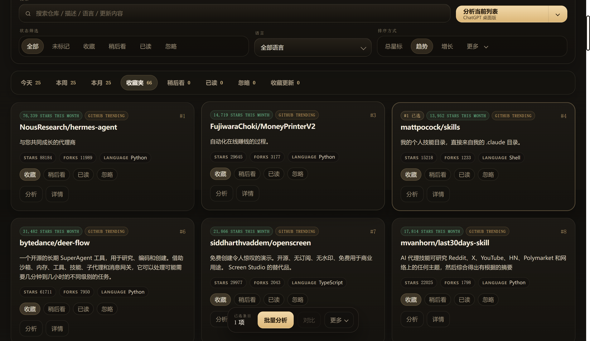
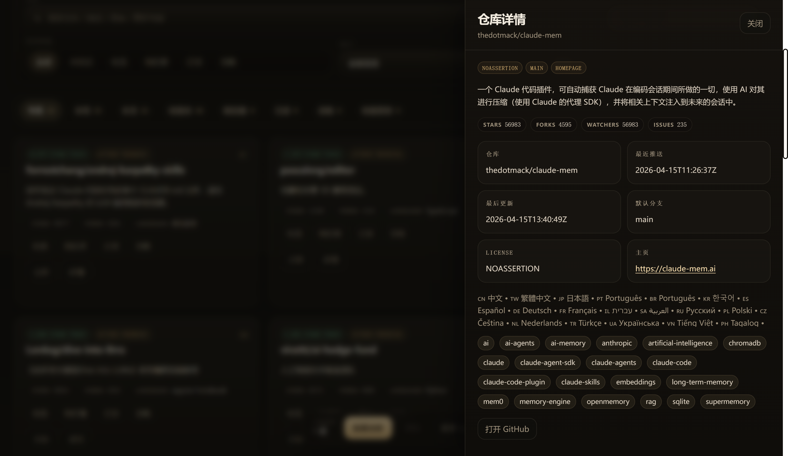

# GitSonar

[English](README.md) | [简体中文](README.zh-CN.md)

> GitHub 情报台  
> 一个用来看热门仓库、收藏项目和跟踪更新的 Windows 桌面应用

GitSonar 是一个用来长期跟踪 GitHub 项目的 Windows 桌面应用。它把趋势列表、项目状态、收藏更新、仓库详情、并排对比和 ChatGPT 提示词整理放在同一个界面里，适合持续关注项目的人使用。

## 它解决什么问题

很多人会刷 GitHub Trending，但真正麻烦的从来不是“打开页面”，而是后面的整套动作：

- 今天、本周、本月到底哪些仓库值得看
- 哪些仓库需要收藏、稍后处理、标记已读，或者直接忽略
- 你已经收藏的仓库，最近到底发生了什么变化
- 一个项目到底在做什么，值不值得长期关注
- 两个相近项目之间，谁更值得继续跟踪

GitSonar 就是把这些零散动作，收进一个长期常驻的桌面工作台中。

## 核心亮点

- **趋势发现**：今天 / 本周 / 本月热门仓库
- **状态管理**：收藏、稍后看、已读、忽略
- **收藏更新追踪**：Push、Star / Fork、Release 变化
- **仓库理解**：详情抽屉与 README 摘要
- **仓库对比**：双仓库并排比较
- **ChatGPT 提示词**：单仓库、批量、对比提示词
- **桌面常驻**：托盘、唤醒、关闭行为可配置、开机启动

## 它适合谁

- 想长期跟踪 GitHub 项目的开发者
- 做技术选型、竞品观察、产品研究的人
- 独立开发者和开源重度用户
- 想把“刷榜”变成“筛选 + 跟踪 + 判断”的人
- 更希望尽快形成判断，而不只是更快浏览的人

## 为什么它不是普通的 Trending 查看器

GitSonar 不只是帮你“看见项目”，而是帮你处理发现之后最耗时间的部分：

- 先发现，再判断
- 先标记，再处理
- 先收藏，再跟踪
- 先对比，再理解
- 先分析，再决策

它更像一个长期运行的 GitHub 情报工作台，而不是一次性打开就结束的网页。

## 快速开始

### 直接使用

1. 运行安装包：`artifacts/dist/installer/GitSonarSetup.exe`
2. 或直接启动免安装版：`artifacts/dist/GitSonar.exe`
3. 第一次启动后，根据需要填写：
   - GitHub Token
   - 代理地址
   - 刷新间隔
   - 榜单数量
   - 关闭行为

### 推荐初始设置

- `GitHub Token`：有条件建议填写
- `代理地址`：网络不稳定时填写本地代理
- `刷新间隔`：建议 `1 小时`
- `榜单数量`：建议 `25`
- `关闭行为`：建议关闭主窗口时保留托盘运行

## 当前已实现能力

### 1. 趋势发现

- 今天 / 本周 / 本月热门仓库
- GitHub Trending 与 GitHub API 双源聚合
- 多种排序方式：总 Stars、Trending、增长、Fork、名称、语言

### 2. 状态管理

- 收藏
- 稍后看
- 已读
- 忽略
- 已选仓库支持批量改状态

### 3. 收藏更新追踪

- 最近推送时间变化
- Star / Fork 变化
- Release 变化
- 收藏更新独立面板集中查看

### 4. 仓库理解与比较

- 仓库详情抽屉
- README 摘要
- 两仓库对比

### 5. ChatGPT 提示词

- 单仓库提示词
- 批量提示词
- 对比提示词
- 打开 ChatGPT 网页版、桌面版或复制提示词

### 6. 桌面化体验

- 系统托盘常驻
- 托盘唤醒
- 关闭行为可配置
- 开机启动
- 代理支持
- GitHub Token 本地加密保存

## 典型工作流

1. 在今天、本周、本月里发现值得看的项目
2. 用收藏、稍后看、已读、忽略整理信息流
3. 查看详情、阅读摘要、对比相近项目
4. 把单仓库、列表或对比结果交给 AI 加速理解
5. 通过“收藏更新”持续跟踪真正重要的仓库

## 截图

**趋势发现** — 浏览今日、本周、本月热门仓库。

**状态管理** — 收藏、待看、已读、忽略，支持批量操作。

**仓库详情** — 抽屉式详情页，含 README 摘要与快捷操作。

**更新追踪** — 监控收藏仓库的推送、Star/Fork 和 Release 变化。

## 优化方向

以下内容是后续演进方向，不代表当前已经实现。

### P0

- **内嵌 AI**：支持 OpenAI、DeepSeek、Ollama 和兼容 OpenAI 协议的接口
- **更强的更新中心**：变化等级、一句话摘要、筛选、静音、“自上次查看以来”
- **首启向导**：连通性检测、代理识别、可选 Token、推荐配置
- **系统通知**：重要仓库事件提醒
- **导航优化**：更清晰地区分发现、清单和更新

### P1

- 全局快捷键
- 更好的网络诊断
- 更完整的产品化门面和发布页表现

### P2

- 数据迁移与备份
- 自动更新
- 自定义订阅和提醒策略

## 命名

- 品牌名：`GitSonar`
- 中文产品名：`GitHub 情报台`
- 标语：`用桌面工作流持续跟踪 GitHub 项目`

当前默认运行数据目录：

- `%LOCALAPPDATA%\GitSonar`

如果检测到旧版本，GitSonar 会尝试从以下目录合并历史数据：

- `%LOCALAPPDATA%\GitHubTrendRadar`

## 许可证

本项目采用 [MIT License](LICENSE)。

## 文档

更详细的说明在 `docs` 目录中：

- [docs/BUILD.md](docs/BUILD.md)
- [docs/ARCHITECTURE.md](docs/ARCHITECTURE.md)
- [docs/FAQ.md](docs/FAQ.md)
- [docs/SECURITY.md](docs/SECURITY.md)

这些文档目前仍以中文为主。

## 仓库结构

- `src/`：桌面入口脚本和应用源码包
- `scripts/`：PowerShell 与 CMD 构建脚本
- `packaging/`：Inno Setup 安装包定义
- `runtime-data/`：本地开发态运行数据、缓存和桌面壳配置
- `artifacts/`：生成的 EXE、安装包与 PyInstaller 临时产物
- `docs/`：构建、架构、FAQ 与安全说明
